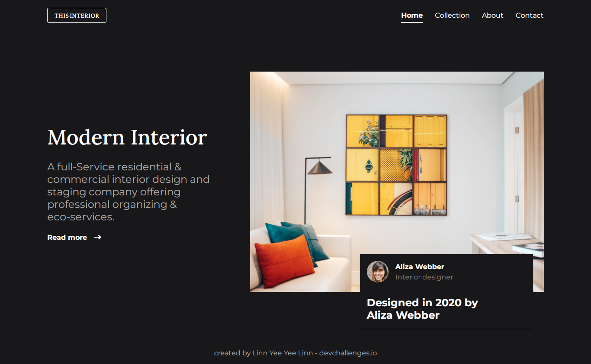

<!-- Please update value in the {}  -->

<h1 align="center">Interior Consultant</h1>

   Solution for a challenge from  <a href="http://devchallenges.io" target="_blank">Devchallenges.io</a>.

  <h3>
    <a href="https://devchallenges3-interior-consultant.netlify.app/">
      Demo
    </a>
     | 
    <a href="https://github.com/LinnYeeYeeLinn/devchallenges3-interior-consultant.git">
      Solution
    </a>
     | 
    <a href="https://devchallenges.io/challenges/Jymh2b2FyebRTUljkNcb">
      Challenge
    </a>
  </h3>

<!-- TABLE OF CONTENTS -->

## Table of Contents

- [Table of Contents](#table-of-contents)
- [Overview](#overview)
  - [Built With](#built-with)
- [Features](#features)
- [Hosting](#hosting)
- [Contact](#contact)

<!-- OVERVIEW -->

## Overview

### Built With

<a href="#">HTML</a> 
<a href="#">CSS</a> 
<a href="#">JavaScript</a> 
<a href="https://fontawesome.com" target="_blank" >FontAwesome</a> for icons

<!-- This section should list any major frameworks that you built your project using. Here are a few examples.-->

## Features

<!-- List the features of your application or follow the template. Don't share the figma file here :) -->

This application/site was created as a submission to a [DevChallenges](https://devchallenges.io/challenges) challenge. The [challenge](https://devchallenges.io/challenges/Jymh2b2FyebRTUljkNcb) was to build an application to complete the given user stories.

## Hosting

<a href="https://www.netlify.com" target="_blank" >Netlify</a> for hosting

<!-- This section should list any articles or add-ons/plugins that helps you to complete the project. This is optional but it will help you in the future. For exmpale -->

## Contact

- GitHub [@LinnYeeYeeLinn](https://github.com/LinnYeeYeeLinn)
